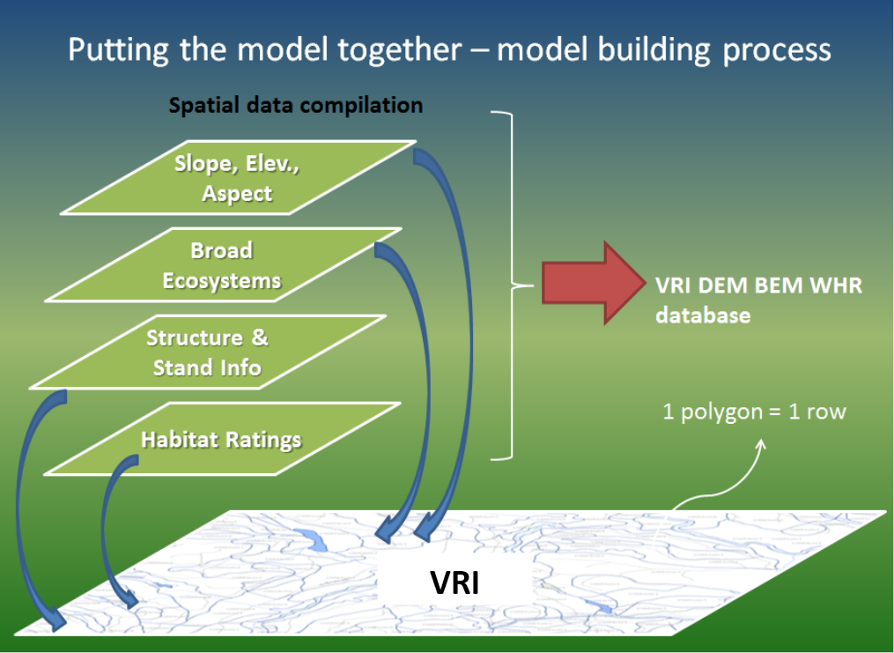

```{r, include = FALSE}
knitr::opts_chunk$set(
  collapse = TRUE,
  comment = "#>"
)
```

The purpose of this article is to help a user get started with the ssgbm package

# Goal of the ssgbm package

The goal of the ssgbm package is to create a file that can be use to run the RRM model.

This file is created by merging the following layers together

- VRI (vegetation ressource inventory [documentation](https://www2.gov.bc.ca/assets/gov/farming-natural-resources-and-industry/forestry/stewardship/forest-analysis-inventory/data-management/standards/vegcomp_poly_rank1_data_dictionaryv5_2019.pdf))

- TEI (Terrestrial Ecosystem Information [documentation](https://www2.gov.bc.ca/assets/gov/environment/plants-animals-and-ecosystems/ecosystems/terrestrial-ecosystem/tei_digital_submission_standards_draft1.pdf)) with BEU fields (Broad Terrestrial Ecosystem [documentation](https://www2.gov.bc.ca/assets/gov/environment/natural-resource-stewardship/nr-laws-policy/risc/bei.pdf))

- Wetlands

- Rivers

- Consolidated Cutblocks

- Elevation

The resulting feature class is usually refereed to as the vri-bem

```{r , echo=FALSE, fig.cap="A caption", out.width = '100%'}

```

Once the layers are merged together, some corrections are done on the TEI attributes based on the VRI attributes, the intersections with rivers and the percentage of the polygon covered by wetlands.
Some of the corrections are done by using the csv files in the csv directory

- Allowed_BEC_BEUs_NE_ALL
- beu_wetland_updates

After all the correction on the TEI attributes have been done, some new attributes are created based on the elevation and the slope.
Also, the forest age is computed using the consolidated cut blocks layer.

Following the creation of those new attributes, several new attributes (see below) of the ecosystem are merged on the vri-bem using the Skeena_VRIBEM_LUT csv file.

- Forested (Y/N),
- Strict_Climax,
- Stand_Climax,
- Stand_Age_0-15, Stand_Age_16-30, Stand_Age_31-50, Stand_Age_51-80, Stand_Age_80+,
- Struct_Age_0-3, Struct_Age_4-10, Struct_Age_11-30, Struct_Age_31-40, Struct_Age_41-60, Struct_Age_61-80, Struct_Age_81-139, Struct_Age_140_249, Struct_Age_250+,
- Snow_code

If you are running the ssgbm package on a new area for the first time, you will need to create and fill this csv file so that you are able to create the desired output file (this article will cover that part later).

Before creating the final output file, the STD_VRI, CROWN_BEAR and CROWN_MOOSE are created based on the type of species and the crown closure of the ecosystem.

Finally, the output file needed for using the RRM model is created by aggregating all the possible combination of the following attributes together

- ECO_SEC
- BGC_ZONE
- BGC_SUBZON
- BGC_VRT
- BGC_PHASE
- BEUMC  (BEUMC_S1, BEUMC_S2, BEUMC_S3)
- SLOPE_MOD
- SITE_M3A
- SNOW_CODE
- ABOVE_ELEV_THOLD
- CROWN_MOOSE (CROWN_MOOSE_1, CROWN_MOOSE_2, CROWN_MOOSE_3)
- STRCT (STRCT_S1, STRCT_S2, STRCT_S3)
- STAND (STAND_A1, STAND_A2, STAND_A3)
- FORESTED (FORESTED_1, FORESTED_2, FORESTED_3)


The following sections of this article will cover in more details how you can achieve all the above using the ssgbm package.

We suggest reading all the sections before jumping in the good stuff. However, if you are too eager to try the ssgbm package, you can get good starting points from the R files in the scripts folder of the [github repositery](https://github.com/bcgov/SSGBM-VRI-BEM/tree/main/scripts) 

# Getting all the required layers

The first step required to be able to use the ssgbm functions is to get all the required layers.

Most layers are available publicly and can be downloaded from the [bcgov catalogue](https://catalogue.data.gov.bc.ca/) (you will probably prefer this option if you want to work with raster see the [Rasterizing Layers of interest] section)

Note that the BEU fields (Broad Terrestrial Ecosystem [documentation](https://www2.gov.bc.ca/assets/gov/environment/natural-resource-stewardship/nr-laws-policy/risc/bei.pdf)) and elevation layers are not available publicly.

However, all the other layers can also be imported into R using via the bcdata package. Fortunately, the ssgbm package has functions to help you import those layers more easily (see the [Read_layer functions] section).

## Read_layer functions

All the layers of interest (except the TEI+BEU and elevation) can be imported via the read_layer functions.
The read_layer also accept a well-known text filter, if you only want to import a region of interest 

```{r read_layers, eval = FALSE}
aoi <- "POLYGON ((1023955 988730.2, 1065018 988730.2, 1065018 1016988, 1023955 1016988, 1023955 988730.2))"
vri <- read_vri(wkt_filter = aoi)
rivers <- read_rivers(wkt_filter = aoi_wkt)
wetlands <- read_wetlands(wkt_filter = aoi_wkt)
ccb <- read_ccb(wkt_filter = aoi_wkt)

```

you can learn more about each of the read_layer by using the help command

```{r read_layers_help, eval = FALSE}
help(read_vri)
```

or by via the [Reference tab of the documentation](https://bcgov.github.io/SSGBM-VRI-BEM/reference/index.html).

# Create the Unique Ecosystem Csv File

Once you have either loaded of converted into raster all the required layers, the next step is to create the unique ecosystem csv that will need to be filled in.

There is two ways to create the unique ecosystem csv file. The first one is using geospatial vector data using `create_unique_ecosystem_from_scratch`.


```{r unique_eco_sf, eval = FALSE}
unique_eco <-  create_unique_ecosystem_from_scratch(dsn = "../SSGBM-VRI-BEM-data/CodeWithUs.gdb",
                                     vri_dsn = "../SSGBM-VRI-BEM-data/VEG_COMP_LYR_R1_POLY",
                                     bem_dsn = "../SSGBM-VRI-BEM-data/BEM_VRI")
````

This function also support wkt filter if you want to create the unique ecosytem csv for a smaller area of interest. Even though, it's possible to create it for a smaller area, we recommend creating the csv using the biggest area possible to make sure that the csv contains all possible ecosystem for which you might want to create the RRM file for.

That being said, it's possible that you won't have enough memory on your computer to create the unique ecosystem csv for the biggest area. Fortunalty, you can interate on an area using the `n_iterations` arguments.

For example, let's run the creation of the unique ecosystem csv by iterating over an area of interest 


```{r unique_eco_sf_iter, eval = FALSE}
aoi <- "POLYGON ((1023955 988730.2, 1065018 988730.2, 1065018 1016988, 1023955 1016988, 1023955 988730.2))"

unique_eco <-  create_unique_ecosystem_from_scratch(dsn = "../SSGBM-VRI-BEM-data/CodeWithUs.gdb",
                                     vri_dsn = "../SSGBM-VRI-BEM-data/VEG_COMP_LYR_R1_POLY",
                                     bem_dsn = "../SSGBM-VRI-BEM-data/BEM_VRI",
                                     wkt_filter = aoi_filter,
                                     n_iterations = 5,
                                     use_ifelse = FALSE)
````


You can do the same using rasters as input files using `create_unique_ecosystem_from_rasters`

```{r unique_eco_rast_iter, eval = FALSE}
aoi <- "POLYGON ((1023955 988730.2, 1065018 988730.2, 1065018 1016988, 1023955 1016988, 1023955 988730.2))"

unique_eco <- create_unique_ecosystem_from_rasters(vri_dsn = "../SSGBM-VRI-BEM-data/vri_test.tif",
                                  bem_dsn = "../SSGBM-VRI-BEM-data/bem_test.tif",
                                  wetlands_dsn = "../SSGBM-VRI-BEM-data/wetlands_test.tif",
                                  rivers_dsn = "../SSGBM-VRI-BEM-data/rivers_test.tif",
                                  ccb_dsn = "../SSGBM-VRI-BEM-data/ccb_test.tif",
                                  elevation_dsn = "../elev_test.tif",
                                  wkt_filter = aoi_filter,
                                  n_iterations = 5)
````


Once you ran the function you can write the R object into a csv using `data.table` `fwrite` function

```{r unique_eco_sf_write, eval = FALSE}
library(data.table)
# simply write the path you want to export the csv to
fwrite(unique_eco, "C:/unique_eco.csv")
````

Once again you can get more information by using the help command

```{r wrap_rasterize_help, eval = FALSE}
help(create_unique_ecosystem_from_scratch)
```

or by via the [Reference tab of the documentation](https://bcgov.github.io/SSGBM-VRI-BEM/reference/index.html).
